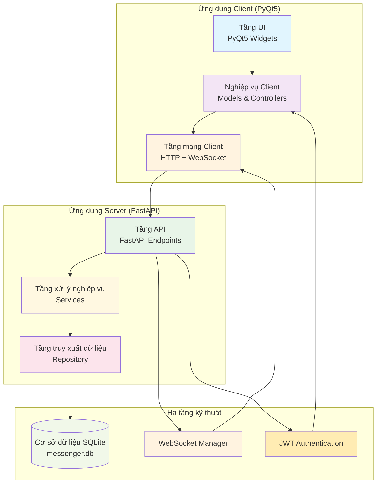
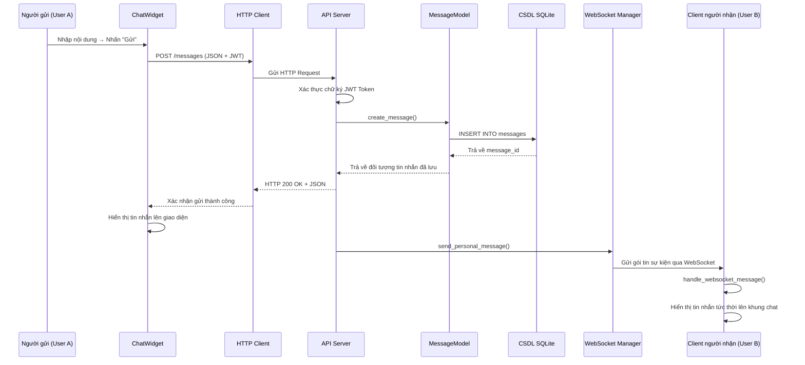
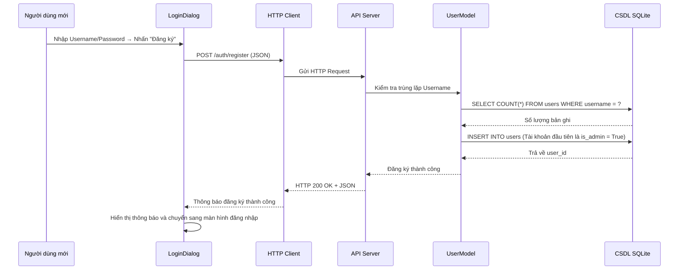
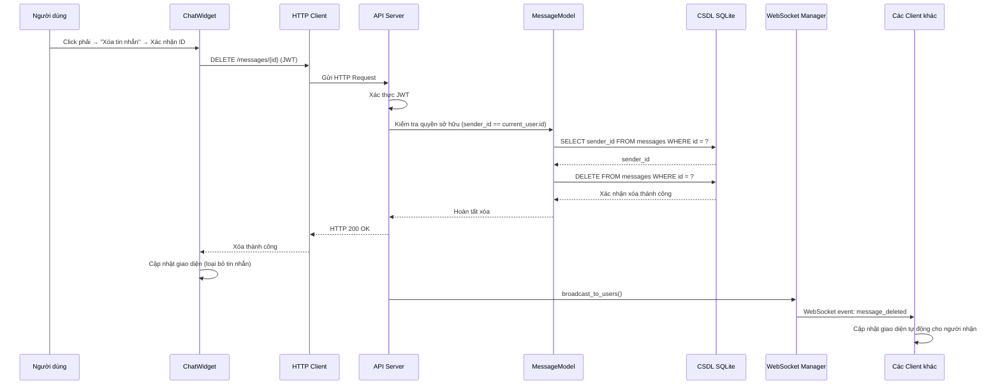
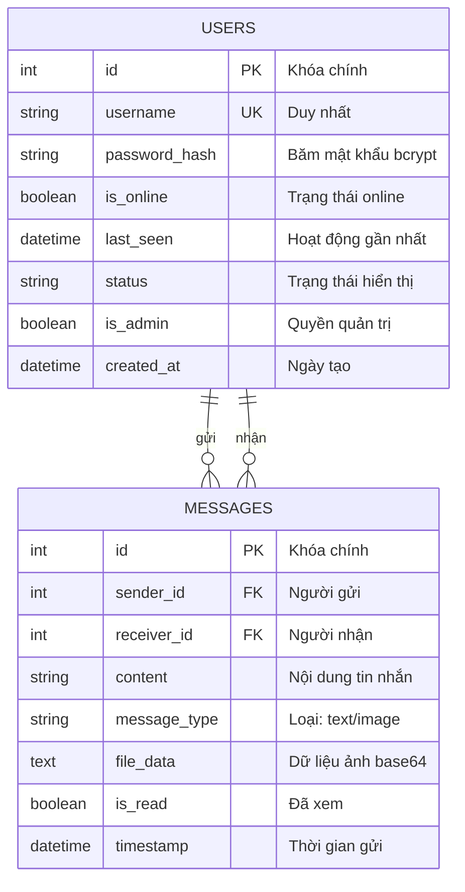

# Tài liệu kiến trúc phần mềm (Software Architecture Document - SAD)
## Hệ thống tin nhắn và trao đổi nội bộ bảo mật (Local Messenger)

**Phiên bản tài liệu:** 1.0  
**Năm:** 2026  
**Đơn vị phát triển:** Ban Dự án Phần mềm & Kỹ thuật Hệ thống  
**Trạng thái:** Tài liệu thiết kế kiến trúc chuẩn mực (Đã hoàn thiện & Sẵn sàng bàn giao)

---

## 1. Kiến trúc tổng thể hệ thống

### 1.1. Sơ đồ kiến trúc mức cao (High-Level Architecture)
```
┌─────────────────────────────────────────────────────────┐
│            Doanh nghiệp / Đơn vị tổ chức               │
│                                                         │
│  ┌──────────────┐            Mạng LAN                ┌──────────────┐ │
│  │   Client 1   │◄──────────(TCP/IP)───────────────►│    Server    │ │
│  │  (PyQt5)     │                                   │   (FastAPI)  │ │
│  └──────────────┘                                   │  ┌─────────┐ │ │
│                                                     │  │ SQLite  │ │ │
│  ┌──────────────┐                                   │  │   CSDL  │ │ │
│  │   Client 2   │◄──────────HTTP/WebSocket─────────►│  └─────────┘ │ │
│  │  (PyQt5)     │                                   └──────────────┘ │
│  └──────────────┘                                                     │
│                                                                       │
│  ┌──────────────┐                                                     │
│  │   Client N   │◄───────────────────────────────────────────────────►│
│  │  (PyQt5)     │                                                     │
│  └──────────────┘                                                     │
└───────────────────────────────────────────────────────────────────────┘
```

### 1.2. Đặc điểm kiến trúc cốt lõi
- **Mô hình Client-Server:** Phân tách rõ ràng giữa giao diện hiển thị, xử lý nghiệp vụ và lưu trữ dữ liệu.
- **REST API:** Xử lý các thao tác đồng bộ (đăng ký, đăng nhập, lịch sử tin nhắn, danh sách người dùng).
- **WebSocket:** Xử lý truyền phát sự kiện bất đồng bộ hai chiều thời gian thực (tin nhắn mới, cập nhật xóa tin nhắn, trạng thái online).
- **Cổng giao tiếp thống nhất:** Server lắng nghe tại cổng `8000`.
- **Cơ sở dữ liệu cục bộ:** SQLite được lưu trữ trực tiếp trên máy chủ server.

---

## 2. Sơ đồ các thành phần (Component Diagram)

### 2.1. Biểu đồ thành phần chi tiết


### 2.2. Phân công nhiệm vụ từng thành phần

#### Phía Client:
| Thành phần | File mã nguồn | Trách nhiệm |
|---|---|---|
| **Tầng UI** | `main_window.py`, `chat_widget.py`, `login_dialog.py` | Giao diện người dùng, tiếp nhận thao tác nhập liệu và hiển thị |
| **Logic nghiệp vụ** | `message.py`, `user.py` | Cấu trúc dữ liệu client, quản lý trạng thái hiển thị |
| **Tầng mạng** | `websocket_client.py`, `config.py` | Gửi request HTTP, duy trì kết nối WebSocket liên tục |

#### Phía Server:
| Thành phần | File mã nguồn | Trách nhiệm |
|---|---|---|
| **Tầng API** | `main.py`, `auth.py`, `messages.py`, `users.py`, `admin.py` | Định tuyến REST endpoints và điểm kết nối WebSocket |
| **Xử lý nghiệp vụ** | `user_model.py`, `message_model.py` | Kiểm tra tính hợp lệ dữ liệu, thực hiện logic ứng dụng |
| **Truy xuất dữ liệu** | `db.py` | Kết nối CSDL SQLite, thực thi các truy vấn CRUD |
| **Hạ tầng bổ trợ** | `websocket_manager.py`, `dependencies.py` | Quản lý danh sách kết nối WebSocket, giải mã và cấp phát JWT |

---

## 3. Biểu đồ tuần tự (Sequence Diagrams)

### 3.1. Luồng gửi và nhận tin nhắn văn bản


### 3.2. Luồng đăng ký tài khoản mới


### 3.3. Luồng xóa tin nhắn


---

## 4. Thiết kế cơ sở dữ liệu (Database Schema)

### 4.1. Sơ đồ thực thể liên kết (ER Diagram)


### 4.2. Cấu trúc chi tiết các bảng SQL

```sql
-- Bảng tài khoản người dùng
CREATE TABLE users (
    id INTEGER PRIMARY KEY AUTOINCREMENT,
    username TEXT UNIQUE NOT NULL,          -- Tên đăng nhập
    password_hash TEXT NOT NULL,            -- Mật khẩu đã băm (bcrypt)
    is_online BOOLEAN DEFAULT FALSE,        -- Trạng thái trực tuyến
    last_seen DATETIME,                     -- Thời gian hoạt động cuối
    status TEXT DEFAULT 'offline',          -- Chuỗi trạng thái
    is_admin BOOLEAN DEFAULT FALSE,         -- Cờ đánh dấu quyền Admin
    created_at DATETIME DEFAULT CURRENT_TIMESTAMP
);

-- Bảng lưu trữ tin nhắn
CREATE TABLE messages (
    id INTEGER PRIMARY KEY AUTOINCREMENT,
    sender_id INTEGER NOT NULL,             -- ID người gửi (FK -> users.id)
    receiver_id INTEGER NOT NULL,           -- ID người nhận (FK -> users.id)
    content TEXT NOT NULL,                  -- Nội dung văn bản
    message_type TEXT DEFAULT 'text',       -- 'text' hoặc 'image'
    file_data TEXT,                         -- Chuỗi base64 của file hình ảnh
    is_read BOOLEAN DEFAULT FALSE,          -- Cờ đã đọc
    timestamp DATETIME DEFAULT CURRENT_TIMESTAMP,
    FOREIGN KEY (sender_id) REFERENCES users (id),
    FOREIGN KEY (receiver_id) REFERENCES users (id)
);
```

---

## 5. Cấu trúc REST API và giao thức WebSocket

### 5.1. Bảng danh mục Endpoints
* `http://{server_ip}:8000/auth`
  * `POST /register`: Đăng ký tài khoản
  * `POST /login`: Đăng nhập lấy access token JWT
  * `POST /logout`: Đăng xuất
* `http://{server_ip}:8000/users`
  * `GET /`: Lấy danh sách toàn bộ người dùng
  * `GET /me`: Lấy thông tin tài khoản đang đăng nhập
  * `GET /{user_id}`: Lấy thông tin chi tiết một người dùng
* `http://{server_ip}:8000/messages`
  * `GET /?contact_id={id}`: Lấy lịch sử tin nhắn với một người dùng
  * `POST /`: Gửi tin nhắn mới (text hoặc hình ảnh base64)
  * `DELETE /{message_id}`: Xóa tin nhắn cá nhân đã gửi
  * `PUT /{message_id}/read`: Đánh dấu tin nhắn đã đọc
* `http://{server_ip}:8000/admin`
  * `GET /all-messages`: Xem toàn bộ tin nhắn trong hệ thống (chỉ dành cho Admin)
  * `GET /all-users`: Quản lý danh sách người dùng toàn hệ thống
* `ws://{server_ip}:8000/ws/{user_id}`: Kênh WebSocket lắng nghe sự kiện tức thời

---

## 6. Đánh giá kiến trúc & Định hướng mở rộng

### Ưu điểm kiến trúc:
1. **Triển khai cực kỳ đơn giản:** Không phụ thuộc hệ quản trị cơ sở dữ liệu rời, chỉ cần một file nhị phân SQLite.
2. **Đa nền tảng:** Hoạt động ổn định trên cả Windows, Linux và macOS.
3. **Tốc độ cao và độ trễ thấp:** Nhờ sự kết hợp của FastAPI bất đồng bộ và kết nối WebSocket bền vững.
4. **Bảo mật chuẩn:** Xác thực phân quyền không lưu trạng thái (stateless) qua JWT, băm mật khẩu chuẩn bcrypt.

### Định hướng nâng cấp trong tương lai:
1. Chuyển đổi từ SQLite sang PostgreSQL khi số lượng người dùng vượt quá 100 kết nối đồng thời.
2. Thay thế việc lưu trữ file Base64 trong CSDL bằng lưu trữ file trên ổ cứng máy chủ hoặc MinIO/S3.
3. Bổ sung mã hóa tin nhắn đầu cuối (End-to-End Encryption).