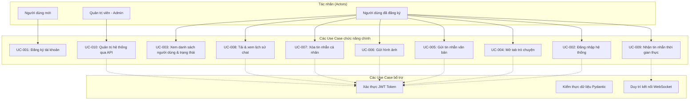

# Tài liệu đặc tả các trường hợp sử dụng (Use Case Document)
## Hệ thống tin nhắn và trao đổi nội bộ bảo mật (Local Messenger)

**Phiên bản tài liệu:** 1.0 (Bản hiện thực thực tế)  
**Năm:** 2026  
**Đơn vị phát triển:** Ban Dự án Phần mềm & Kỹ thuật Hệ thống  
**Trạng thái:** Tài liệu đặc tả ca sử dụng chuẩn mực (Đã đối soát 100% với mã nguồn)

---

## 1. Biểu đồ tổng thể các trường hợp sử dụng (Use Case Diagram)

---

## 2. Đặc tả chi tiết các Use Case chính

### UC-001: Đăng ký tài khoản mới
* **Mã UC:** UC-001
* **Tác nhân chính:** Người dùng mới (New User)
* **Tiền điều kiện:** Máy chủ Server đang chạy và kết nối mạng thông suốt.
* **Hậu điều kiện:** Bản ghi người dùng được tạo trong CSDL SQLite, có thể đăng nhập.
* **Luồng sự kiện chính:**
  1. Người dùng mở ứng dụng Client.
  2. Hệ thống hiển thị hộp thoại đăng nhập / đăng ký.
  3. Người dùng nhập Username và Password mong muốn.
  4. Người dùng nhấn nút "Đăng ký".
  5. Hệ thống kiểm tra xem Username đã tồn tại trong CSDL chưa.
  6. Nếu hợp lệ, hệ thống băm mật khẩu với bcrypt và lưu vào bảng `users`.
  7. Nếu đây là tài khoản đầu tiên trong hệ thống, tự động đặt cờ `is_admin = True`.
  8. Hiển thị thông báo "Registration successful" và đóng hộp thoại đăng ký.
* **Luồng phụ / Ngoại lệ:**
  * *A1: Tên đăng nhập bị trùng*: Báo lỗi "Username already exists", yêu cầu nhập tên khác.
  * *A2: Mất kết nối Server*: Báo lỗi "Cannot connect to server".

---

### UC-002: Đăng nhập vào hệ thống
* **Mã UC:** UC-002
* **Tác nhân chính:** Người dùng đã có tài khoản (Registered User)
* **Tiền điều kiện:** Người dùng đã đăng ký thành công trên hệ thống.
* **Hậu điều kiện:** Cấp phát Access Token JWT, mở giao diện ứng dụng chính.
* **Luồng sự kiện chính:**
  1. Người dùng nhập thông tin đăng nhập và nhấn "Đăng nhập".
  2. Client gửi yêu cầu `POST /auth/login` kèm JSON thông tin.
  3. Server xác thực thông tin tài khoản qua hàm băm mật khẩu bcrypt.
  4. Server sinh mã truy cập JWT (thời hạn 24 giờ) và cập nhật `is_online = True`.
  5. Client lưu token vào bộ nhớ và hiển thị cửa sổ `MainWindow`.
  6. Client mở luồng kết nối WebSocket liên tục `ws://.../ws/{user_id}` để đón nhận sự kiện.
* **Luồng ngoại lệ:** Nhập sai mật khẩu hoặc tài khoản không tồn tại $\rightarrow$ Trả về mã lỗi 400 kèm thông báo "Invalid credentials".

---

### UC-003: Xem danh sách người dùng & trạng thái trực tuyến
* **Mã UC:** UC-003
* **Tác nhân chính:** Người dùng đã đăng nhập
* **Luồng sự kiện chính:**
  1. Sau khi vào màn hình chính, Client gửi `GET /users`.
  2. Server trả về danh sách tất cả các tài khoản kèm trạng thái `is_online`.
  3. Cột danh bạ hiển thị biểu tượng [Online] cho người đang online và [Offline] cho người offline.
  4. Bộ đếm thời gian (QTimer) tự động chạy ngầm mỗi 10 giây để cập nhật lại danh bạ.

---

### UC-004: Mở tab trò chuyện riêng
* **Mã UC:** UC-004
* **Tác nhân chính:** Người dùng đã đăng nhập
* **Luồng sự kiện chính:**
  1. Người dùng nhấp chuột vào một liên hệ trong danh bạ.
  2. Hệ thống kiểm tra xem tab chat với người này đã mở chưa.
  3. Nếu chưa mở: Tạo tab mới trên thanh tab, kích hoạt `ChatWidget`, tự động gọi `GET /messages?contact_id={id}` để tải lịch sử.
  4. Nếu đã mở: Chuyển tiêu điểm (focus) sang tab tương ứng.

---

### UC-005: Gửi tin nhắn văn bản
* **Mã UC:** UC-005
* **Tác nhân chính:** Người dùng trong phòng chat
* **Luồng sự kiện chính:**
  1. Nhập nội dung vào khung soạn thảo và bấm "Gửi" hoặc gõ phím Enter.
  2. Client kiểm tra nội dung không được để trống.
  3. Gửi yêu cầu `POST /messages` kèm token JWT lên Server.
  4. Server lưu tin nhắn vào bảng `messages` trong CSDL.
  5. Server gửi gói sự kiện qua WebSocket tới người nhận (nếu đang online).
  6. Giao diện người gửi cập nhật tin nhắn ngay lập tức (màu xanh, căn phải, có mốc giờ).

---

### UC-006: Gửi và xem hình ảnh
* **Mã UC:** UC-006
* **Tác nhân chính:** Người dùng trong phòng chat
* **Luồng sự kiện chính:**
  1. Bấm nút [Đính kèm] $\rightarrow$ Chọn file ảnh (.png, .jpg, .gif, .bmp) từ máy tính.
  2. Client chuyển đổi dữ liệu file ảnh sang chuỗi Base64.
  3. Gửi tin nhắn loại `image` lên Server.
  4. Server lưu chuỗi Base64 vào CSDL và phát WebSocket cho người nhận.
  5. Hai bên khung chat lập tức kết xuất ảnh với kích thước chiều rộng cố định 200px.

---

### UC-007: Xóa tin nhắn đã gửi
* **Mã UC:** UC-007
* **Tác nhân chính:** Người đã gửi tin nhắn
* **Luồng sự kiện chính:**
  1. Nhấp chuột phải vào tin nhắn $\rightarrow$ Chọn "Delete Message".
  2. Nhập ID tin nhắn xác nhận.
  3. Client gửi `DELETE /messages/{id}`.
  4. Server kiểm tra ID người gửi có trùng với tài khoản đang đăng nhập hay không.
  5. Nếu hợp lệ: Xóa khỏi CSDL và gửi gói tin WebSocket `message_deleted` tới tất cả các bên.
  6. Giao diện các Client tự động vẽ lại và loại bỏ tin nhắn bị xóa.

---

### UC-008: Quản trị hệ thống qua API (Admin)
* **Mã UC:** UC-010
* **Tác nhân chính:** Tài khoản có quyền Quản trị viên (Admin)
* **Luồng sự kiện:**
  1. Quản trị viên gửi request `GET /admin/all-messages` hoặc `GET /admin/all-users`.
  2. Server kiểm tra cờ `is_admin` trong token.
  3. Nếu không phải Admin: Trả về lỗi 403 Forbidden ("Admin access required").
  4. Nếu là Admin: Trả về toàn bộ dữ liệu hệ thống phục vụ kiểm tra, đánh giá.

---

## 3. Bảng phân loại Tác nhân (Actors)

| Tác nhân | Vai trò trong hệ thống |
|---|---|
| **Khách mới (New User)** | Người chưa có tài khoản, chỉ có thể thực hiện đăng ký |
| **Người dùng đăng ký (Registered User)** | Người dùng chính thống: nhắn tin, gửi ảnh, xóa tin của mình |
| **Quản trị viên (Administrator)** | Người đăng ký đầu tiên: toàn quyền truy xuất API quản trị |
| **Hệ thống WebSocket Manager** | Tác nhân ngầm: duy trì kết nối mạng và điều phối gói tin đẩy |

---

*Tài liệu đặc tả ca sử dụng - Dự án Local Messenger 2026*